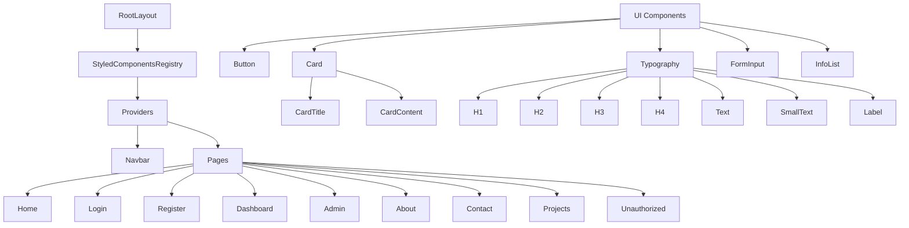
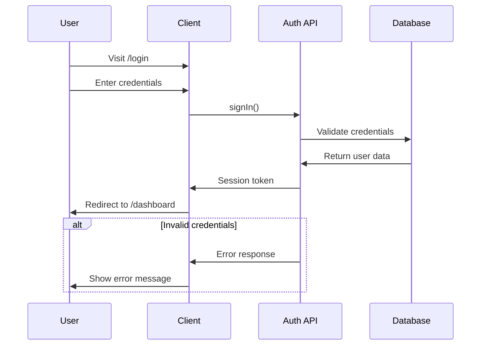
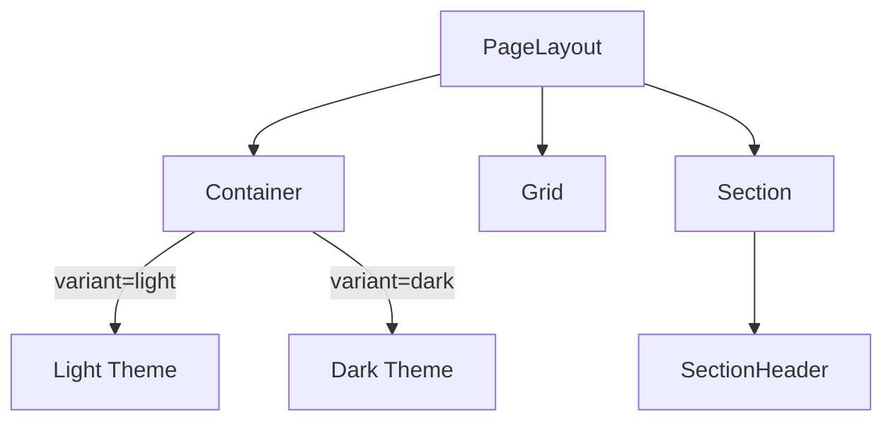
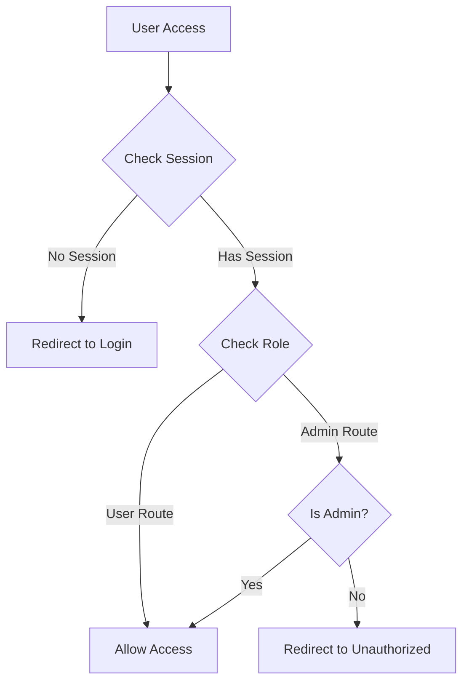
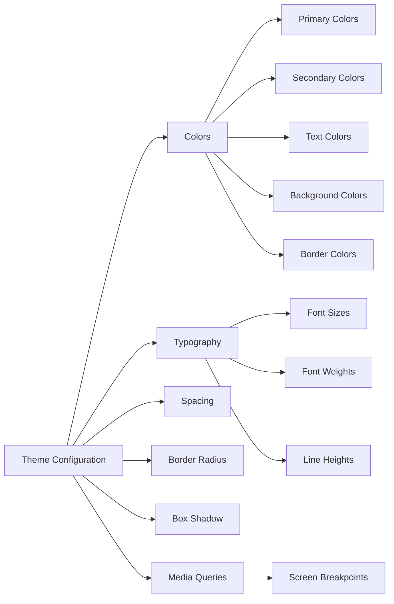
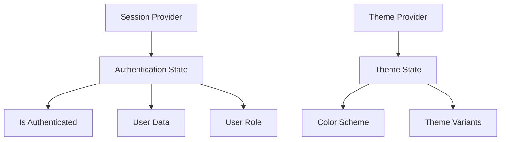
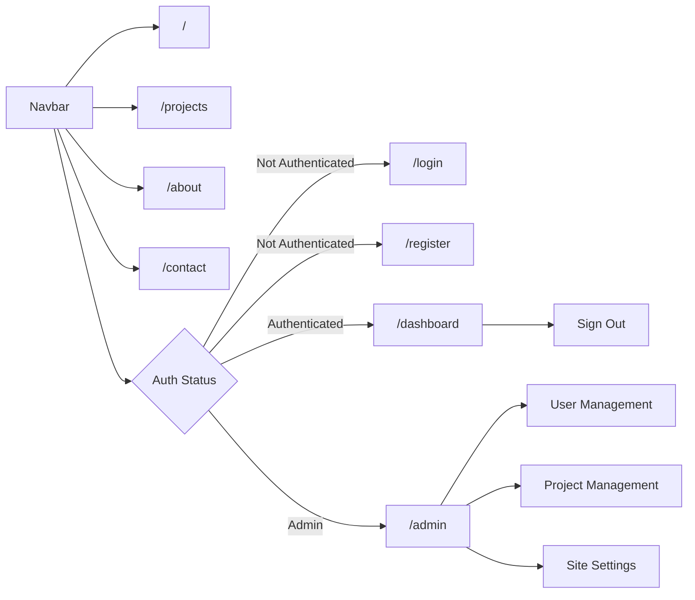
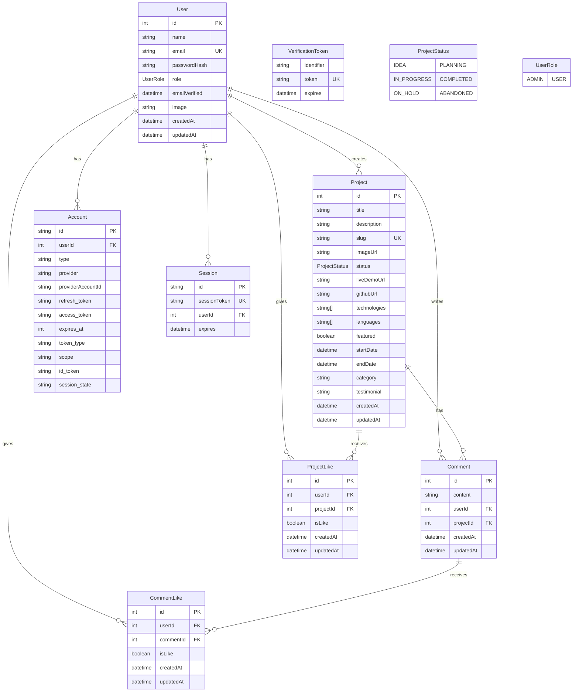
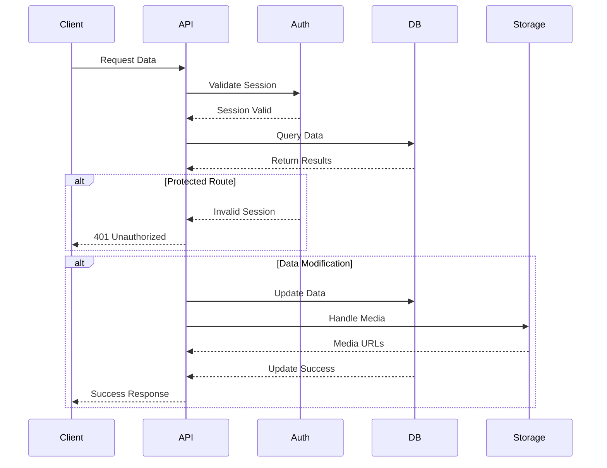
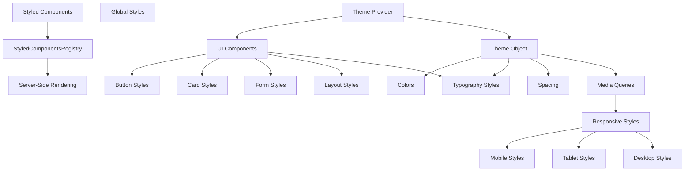

# Application Architecture Diagrams

## Component Hierarchy



## Authentication Flow



## Page Layout Structure



## Route Protection Flow



## Theme System



## State Management



## Navigation Structure



## Database Schema



## API Endpoints Structure

```mermaid
graph TB
    API[API Routes]

    API --> Auth[/api/auth]
    Auth --> NextAuth[/.../nextauth]
    Auth --> Me[/me]
    Auth --> Register[/register]

    API --> Projects[/api/projects]
    Projects --> CRUD[CRUD Operations]
    Projects --> Languages[Language Management]
    Projects --> Comments[Comment Management]
    Projects --> Likes[Like Management]

    API --> Admin[/api/admin]
    Admin --> Users[User Management]
    Admin --> Settings[Site Settings]

    classDef protected fill:#f9f,stroke:#333,stroke-width:2px
    class Admin,Me protected
```

## Data Flow



## Styling Architecture


